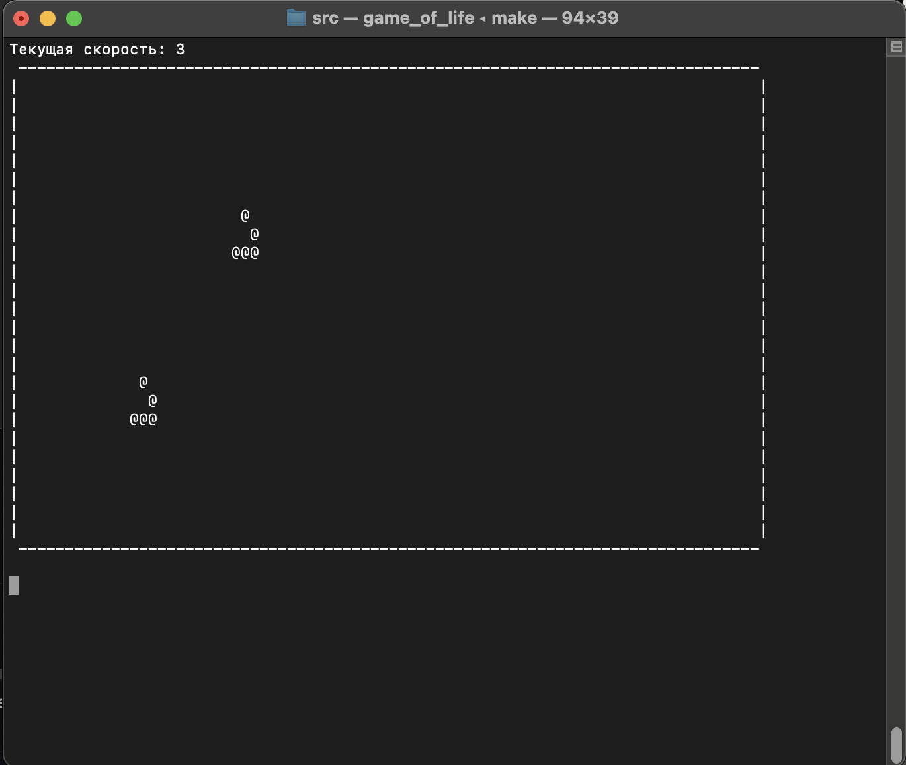

# c-game-of-life

Project date: 08-2022

***== The program src/game_of_life.c, which is a visualization of "The Game of Life", is developed in the C programming language. Only character (ASCII) graphics (with output to the terminal) are used to display the graphics. Also, an interactive mode is implemented, with the game speed setting. ==***

* ***Graphics***

The field is a rectangle of 80 by 25 squares.
The field is supposed to be "closed to itself", for example, the bottom right square has a neighbor on the right, and the neighbor on the bottom is the top right square.

The initial initialization of the "game" state via stdin is provided. Prepare 5 files (in the initial_states folder) with the initial state for quick start and initialization through redirection of input. 

* ***Control***

'a' - reduction of speed  
'd' - increase in speed  
'q' - exit 

### Project build

The project is build through a Makefile in the src folder with the command  *make*

### Rules

The Game of Life is a cellular automaton invented by the English mathematician John Conway in 1970.
It is a playerless game in which a person creates an initial state and then only observes its development.

- The place of action of the game is a marked plane, which can be infinite, limited or closed.
- Each cell on this surface has eight neighbors surrounding it and can be in two states: "alive" (filled) or "dead" (empty).
- The distribution of live cells at the beginning of the game is called the first generation. Each subsequent generation is calculated based on the previous one according to these rules:
    * in an empty (dead) cell with three living cells adjacent to it, life is born;
    * if a living cell has two or three living neighbors, the cell continues to live; otherwise (if there are fewer than two or more than three living neighbors) the cell dies ("from solitude" or "from overpopulation").
- The game stops if
    * no "living" cells remain on the board;
    * the configuration on the next step will repeat itself exactly (without shifts and turns) on one of the earlier steps (a periodic configuration is formed)
    * At the next step none of the cells changes its state (a special case of the previous rule, a stable configuration is formed)
**- Wikipedia**
